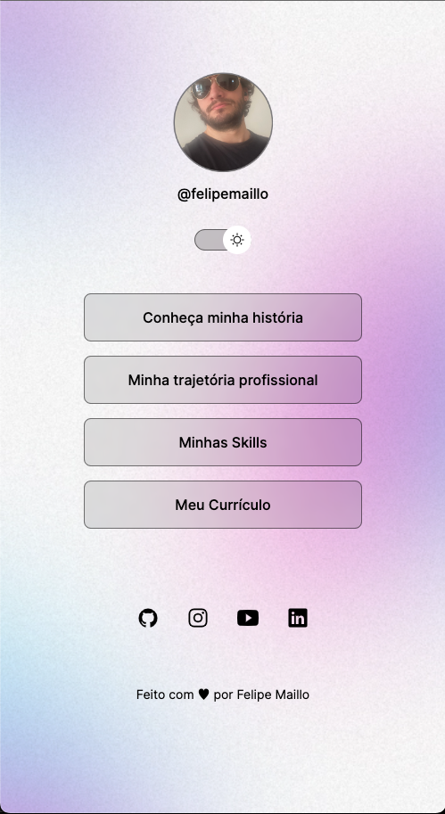

<h1 align="center"> Cartão de Visitas </h1>

  Uma ideia simples mas que ajudou bastante para aprimorar meus conhecimentos em desenvolvimento WEB.  

  <a href="#-tecnologias">Tecnologias</a>&nbsp;&nbsp;&nbsp;|&nbsp;&nbsp;&nbsp;
  <a href="#-projeto">Projeto</a>&nbsp;&nbsp;&nbsp;|&nbsp;&nbsp;&nbsp;
  <a href="#-layout">Layout</a>&nbsp;&nbsp;&nbsp;|&nbsp;&nbsp;&nbsp;
  <a href="#-detalhes">Detalhes sobre o desenvolvimento</a>&nbsp;&nbsp;&nbsp;|&nbsp;&nbsp;&nbsp;
  <a href="#memo-licença">Licença</a>

  

 

  
  

---

Para ver como o projeto ficou, <a href="https://felipemaillo.github.io/cartao-visitas/#ptbr">Clique aqui</a>

---

## 🚀 Tecnologias

Esse projeto foi desenvolvido com as seguintes tecnologias:

- HTML e CSS
- JavaScript
- Git e Github
- Figma

---

## 💻 Projeto

Como voltei meus estudo com JS, CSS e HTML resolvi criar esse cartão de visitas para demostrar o que estou aprendendo.
Nele podemos ver que temos uma diferença entre Dark Theme e Light Theme.

- Dependendo do tema selecionado, a página terá seu fundo, suas cores e o avatar trocados.

---

## 🔖 Layout

Você pode visualizar o layout do projeto através [DESSE LINK](https://www.figma.com/community/file/1187422022288947321). É necessário ter conta no [Figma](https://figma.com) para acessá-lo.

---

## 📝 Detalhes sobre o desenvolvimento

- Como voltei meus estudo com JS, CSS e HTML resolvi criar esse portfólio para demostrar o que estou aprendendo.
- Nele podemos ver que temos uma diferença entre Dark Theme e Light Theme.
  - Dependendo do tema selecionado, a página terá seu fundo, suas cores e o avatar trocados.

---

## 🔐 Licença

Esse projeto está sob a licença MIT.

---
